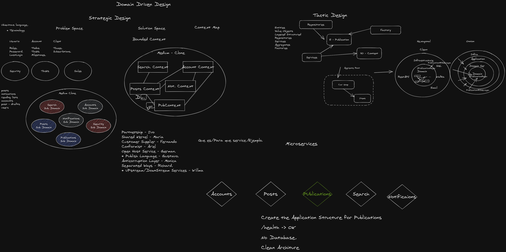

# Medium

Medium is an open platform where readers find dynamic thinking, and where expert and undiscovered voices can share their writing on any topic.

## Prerequisites 🔨

1. Install Windows 10 or Linux
2. Install dotnet version >= 5.x.x (suggested: 5.0.201)
3. Install MongoDb version >= 4.4 (suggested: 4.4)
4. Install RabbitMQ version >= 3.8.x (suggested: 3.8.14)

### Optional install prerequisites in docker

Follow these instructions if you are using docker.

1. Install Docker version 20.10.x (suggested: 20.10.5)
2. Install PostgreSql 10 in docker container.
3. Install MongoDb 4.4 in docker container.
4. Install RabbitMQ 3.8.x in docker container. (suggested: 3.8.14)

#### 1. Install Docker version 20.10.5
- Verify docker is already installed.
``` docker --version ```

#### 2. Install MongoDb 4.1 in docker container.
1. Dowload the image:
``` docker pull mongo:4.4 ```
2. Create and start mongo db docker container with:
``` docker run -d --name mongodb1 -p 27017:27017 mongo:4.4 ```
3. Enter docker bash:
``` docker exec -it mongodb1 bash ```
4. enter mongo shell.
``` mongo```
5. Create db
``` use medium_publications```
``` use medium_posts```
``` use medium_accounts```
``` use medium_search```
6. Exit:
``` exit ```
7. Credentials:
```
host: localhost/ip
port: 27017
dbname: medium_publications
user: root
pass: root
```

#### 3. Install MySQL 5 in docker container.
1. Dowload the image:
``` docker pull mysql:5 ```
2. Create and start mongo db docker container with:
``` docker run -d --name mysql -e MYSQL_ROOT_PASSWORD=secret123 -p 3306:3306 mysql:5 ```
3. Create data base: ``` medium_accounts ```
4. Credentials:
```
host: localhost/ip
port: 3306
dbname: medium_accounts
user: root
pass: secret123
```

#### 4. Install cassandra:3.11.4 in docker container.
1. Dowload the image: ``` docker pull cassandra:3.11.4 ```
2. Create and start mongo db docker container with: ``` docker run -d --name cassandradb  -p 7000:7000  cassandra:3.11.4 ```
3. Enter cassandra bash: ```docker exec -it some-cassandra bash```
3. Credentials:
```
host: localhost/ip
port: 7000
dbname: posts_accounts
user: 
pass:
```

#### 5. Install RabbitMQ 3.8.14 in docker container.
1. Dowload the image:
``` docker pull rabbitmq:3.8.14-management ```
2. Start container with:
``` docker run -d --name rabbitmq -p 15672:15672 -p 5672:5672 rabbitmq:3.8.14-management ```
3. Credentials:
```
host: localhost/ip
port: 15672
management: localhost:15672
user: guest
pass: guest
```

## Configuration 🔧

## Deploy 🚀

### Order

Follow this order of deployment when running the application: 
1.	Run Gateway microservices ```Medium.Gateway```.
2.	Run Publications microservices ```Medium.Publications```.
3.	Run Posts microservices ```Medium.Posts```.
4.	Run Accounts microservices ```Medium.Accounts```.
5.	Run Search microservices ```Medium.Search```.

### Run App
1. Enter Medium.Gateway and execute  ```dotnet run```.
2. Enter Medium.Publications/Medium.Publications.APIRest and execute  ```dotnet run```.
3. Enter Medium.Posts/Medium.Posts.APIRest and execute  ```dotnet run```.
4. Enter Medium.Accounts/Medium.Accounts.APIRest and execute  ```dotnet run```.
5. Enter Medium.Search and/Medium.Search.APIRest execute  ```dotnet run```.


## Documentation 🔍

After running backend services you can see endpoints documentation on the following URLs:
```
Publications microservices  : https://localhost:5005/swagger/index.html
Posts microservices  : https://localhost:5007/swagger/index.html
Accounts microservices  : https://localhost:5009/swagger/index.html
Search microservices  : https://localhost:5011/swagger/index.html

```
### API Gateway Ocelot:
HTTPS

- GET: ```https://localhost:5001/publication```
- GET: ```https://localhost:5001/publication/{id}```
- GET: ```https://localhost:5001/publication/author/{author}```
- DELETE: ```https://localhost:5001/publication/{id}```
- POST: ```https://localhost:5001/publication``
- POST: ```https://localhost:5001/publication`

- GET: ```https://localhost:5001/posts```
- GET: ```https://localhost:5001/posts/{id}```
- GET: ```https://localhost:5001/posts/author/{author}```
- DELETE: ```https://localhost:5001/posts/{id}```
- PUT: ```https://localhost:5001/posts`
- POST: ```https://localhost:5001/posts`

### Publications microservices endpoints:  

HTTP

- GET: ```http://localhost:5004/publication```
- GET: ```http://localhost:5004/publication/{id}```
- GET: ```http://localhost:5004/publication/author/{author}```
- DELETE: ```http://localhost:5004/publication/{id}```
- PUT: ```http://localhost:5004/publication``
- POST: ```http://localhost:5004/publication`

HTTPS

- GET: ```https://localhost:5005/publication```
- GET: ```https://localhost:5005/publication/{id}```
- GET: ```https://localhost:5005/publication/author/{author}```
- DELETE: ```https://localhost:5005/publication/{id}```
- PUT: ```https://localhost:5005/publication/{id}```
- POST: ```https://localhost:5005/publication```

Schema::
```
{
  "BlogId": "123e4567-e89b-12d3-a456-426614174000",
  "Title": "Continous Integration in GitLab 200",
  "Author": "richardseverich"
}
```

### Posts microservices endpoints:  
s
HTTP

- GET: ```http://localhost:5006/posts```
- GET: ```http://localhost:5006/posts/{id}```
- DELETE: ```http://localhost:5006/posts/{id}```
- PUT: ```http://localhost:5006/posts`
- POST: ```http://localhost:5006/posts`

HTTPS

- GET: ```https://localhost:5007/posts```
- GET: ```https://localhost:5007/posts/{id}```
- DELETE: ```https://localhost:5007/posts/{id}```
- PUT: ```https://localhost:5007/posts``
- POST: ```https://localhost:5007/posts``

Schema:

```
{
  "id": "0e34cfb9-1d34-4bbb-b2be-c1d222db7f14",
  "blogId": "123e4567-e89b-12d3-a456-426614174000",
  "publicationId": "6907fda2-e602-4be1-96f9-ae63e0d971a4",
  "title": "Continous Integration in GitLab 1",
  "content": "",
  "author": {
    "id": "a6e73af6-0c6d-425a-a14b-95588e2c6317",
    "username": "richardseverich",
    "fullName": "Default Full Name",
    "email": "Default Email"
  },
  "avatar": "",
  "releaseDate": "2021-05-30T22:52:01.83Z"
},
```

## Diagrams

### Diagram - General DDD
<p align="center">
  
</p>

### Diagram - DDD - Strategic Design
<p align="center">
  
</p>

### Diagram - DDD - Tactical Design
<p align="center">
  
</p>

### Diagram - DDD - Tactical Design
<p align="center">
  
</p>

### Diagram - Class 📉
<p align="center">
  
</p>

### Diagram - Usecases
<p align="center">
  
</p>

### Diagram - Medium Publication Domain Classes
<p align="center">
  
</p>

### Diagram - Medium Publication Services Classes
<p align="center">
  
</p>

### Medium Publication Post Request
<p align="center">
  
</p>

### Medium Publication Get Request
<p align="center">
  
</p>

### Medium Post Get Request
<p align="center">
  
</p>


### DataBasesMongo
<p align="center">
  
</p>

## Contributing 💡

1. Clone it!
2. Create your feature branch: `git checkout -b FeatureSomeFeatureName`
3. Commit your changes: `git commit -m 'FeatureSomeFeatureName: Add some feature'`
4. Push to the branch: `git push origin FeatureSomeFeatureName`
5. Submit a mergue request.
